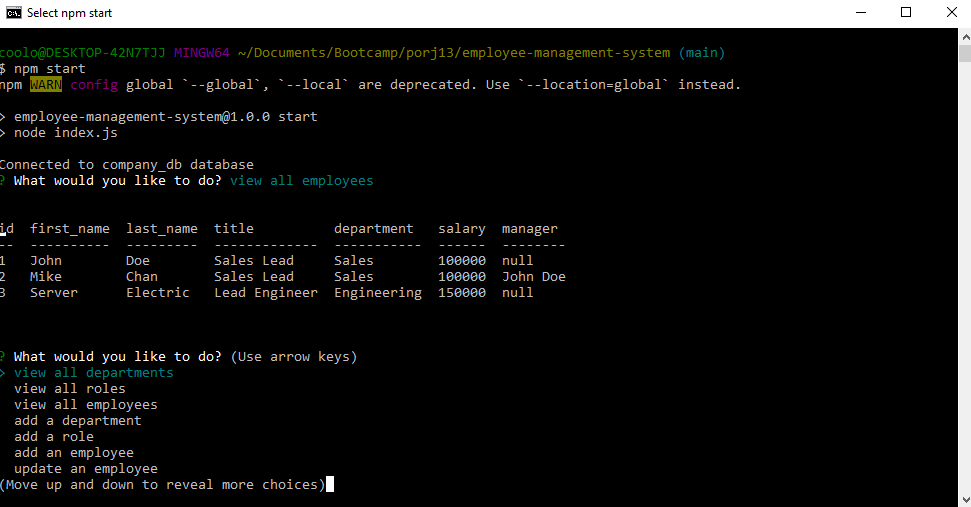

# Employee Management System

## Description

This application creates a company database using mySQL to keep track of departments, positions, and employees. Features of this application include quickly viewing, adding, and updating existing departments, positions, and employees of the company. 

This project runs on Node.js and requires 4 npm packages: inquirer to prompt for user data, mysql2 for connecting to sql database and manipulating data, console.table to display sql tables in the console, and dotenv to hide credentials.

## Working Project

## Table of Contents
* [Installation](#installation)

* [Tutorial](#tutorial)

* [Credits](#credits)

* [License](#license)

* [Questions](#questions) 

## Installation
1) Clone down the repository via ssh key
2) Git Bash/ Terminal to where the directory is stored on your local machine
3) Open mysql shell and run 'source ./db/schema.sql' and 'source ./db/seed.sql' then exit shell
4) Open the '.env' file and set the values to each key: 'database=company_db', 'user=root', and 'pass={your sql password}'
4) Run 'npm install' to download the required node packages
5) Run 'npm start' to start the program

## Tutorial

[Tutorial Link](https://youtu.be/ylXMVI3Kl3E)

## Credits
Inquirer package [documentation](https://www.npmjs.com/package//inquirer)

## License
 

Licensed under the [MIT](https://opensource.org/licenses/MIT) license

## Questions
Contact me via email at hmanjun@ucsc.edu
View my other projects on [github](github.com/hmanjun) 